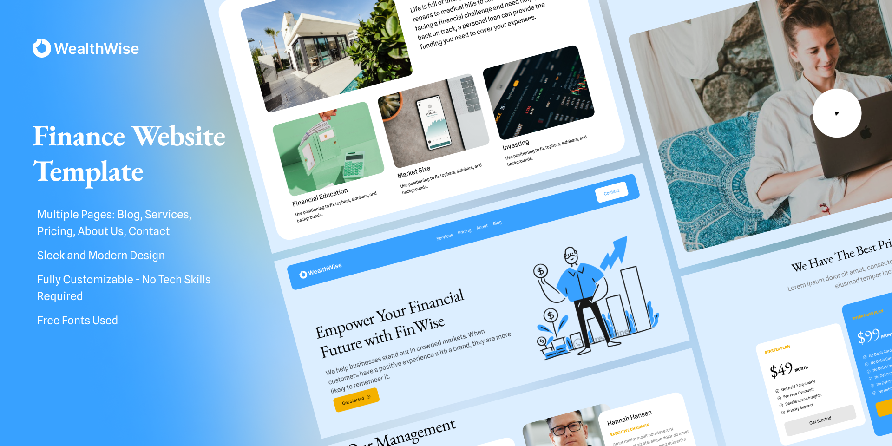

# WealthWish

> This is figma Design ➡ [Go](<https://l.messenger.com/l.php?u=https%3A%2F%2Fwww.figma.com%2Fdesign%2FSvigZKPqARHWHKue2oX51a%2FFinance-Website-Template-(Community)%3Fm%3Ddev%26node-id%3D0%253A1%26t%3DxvCqiSGVQwFCS1II-1&h=AT0jGk8JHveFIANyOAVjXCL604TiSLtbPS-VNP60HcMiFgrBSMSzQ0b1XCquD22bq2N7BgEtQNRCLm-tX8UvT_4H9Of7mUtNR0bM2OC9F9tJU-2cplVeh7JY8ymaQv4oCiyGoziCIGUP_BA61GJ2oA>)

> In this project I used :
>
> - React + Vite
> - Typescript
> - react-router-dom
> - lucide-react
> - Tailwind css

---

If you want to `clone` this project, follow this steps:
 

